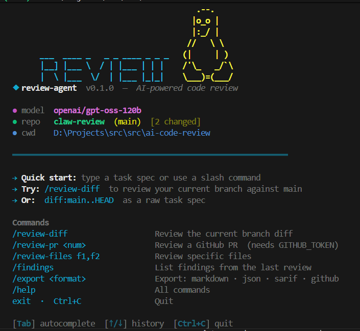

# 🦞 Claw Review

> **AI-powered, read-only code review agent** — think Claude Code's architecture, but enforcing a hard invariant: **no tool can mutate source files or remote state**.

The agent reads code, runs analyzers, and emits structured findings; a GitHub Action turns those findings into PR review comments.

---

## Demo

<p align="center">
  
</p>

---
## Quick start

```bash
uv venv && source .venv/bin/activate
uv pip install -e ".[dev]"
export GROQ_API_KEY=...
review --task "diff:main..HEAD" --format markdown
```

## Architecture

| Component | File |
|---|---|
| Agent loop | `src/review_agent/engine.py` |
| Tool ABC | `src/review_agent/tool.py` |
| Tool registry (read-only guard) | `src/review_agent/registry.py` |
| Groq streaming client | `src/review_agent/llm/groq_client.py` |
| Findings model + store | `src/review_agent/findings/` |
| Sub-reviewer dispatch | `src/review_agent/coordinator.py` |
| Reviewer manifests | `src/review_agent/reviewers/*.md` |
| Slash commands | `src/review_agent/commands/` |
| CLI | `src/review_agent/cli.py` |

## Read-only invariant

The `ToolRegistry.register()` method raises if a tool's `is_read_only` ClassVar is anything other than the literal `True`. There is no generic shell tool — every analyzer (git diff, ripgrep, ruff, semgrep, etc.) is its own typed wrapper that hardcodes its argv. See `tests/test_registry_readonly.py`.
